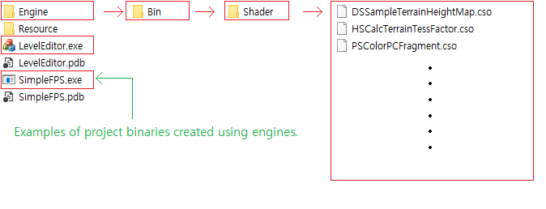

# ZergEngine
ZergEngine is a simple game engine based on DirectX 11.

## How to Build
This project supports only Windows 10 platforms and is built only in the Microsoft Visual Studio 2022 environment.

### Note
- Based on the folder where the executable binary(.exe) is located, you must place the compiled shader object(.cso) files that result from the build in the Engine\Bin\Shader\ folder path.

